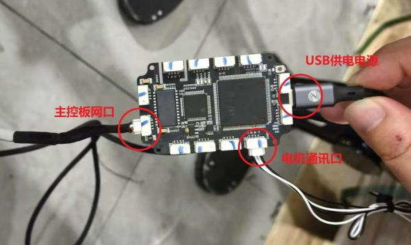

# 电机标定脚本使用说明

## 一、编译工程

进入工程根目录，打开终端，执行编译脚本：

```bash
./scripts/build.sh
```

编译完成后，再运行电机标定脚本。

## 二、运行脚本

脚本运行时需要指定模式和网口名称。

### 1. 装配前：电机标 ID

机器人装配前，对单个电机进行 ID 读取或设置时，使用 `single` 模式：

```bash
./scripts/run.sh --mode single --net ens33
```

其中，`ens33` 需要替换为实际使用的网口名称。

### 2. 装配后：关节位置读取与电机标零

机器人装配完成后，进行关节位置读取和电机标零时，使用 `robot` 模式：

```bash
./scripts/run.sh --mode robot --net ens33
```

如果不指定 `--mode`，脚本默认使用 `robot` 模式。

## 三、脚本功能说明

脚本启动后，会进入功能菜单，主要操作包括：

### 1. 读取电机 ID

选择“读取电机 ID”，根据提示输入 `slave_id`；

用于查看当前从站下连接的电机 ID；

常用于装配前确认电机当前 ID。

### 2. 设置电机 ID

选择“设置电机 ID”，根据提示依次输入：

```text
slave_id
当前/旧 motor_id
目标/新 motor_id
```

用于将电机从旧 ID 修改为新的目标 ID；

建议标 ID 时一次只连接一个目标电机，避免误操作其他电机。

### 3. 读取关节位置

选择“关节位置”，根据提示输入关节编号。用于读取指定关节的当前位置，方便确认电机反馈和零位状态。

关节编号范围为 `1-31`，例如：

```
1-头部1
2-头部2
3-左手1
...
31-右腿6
```

脚本会根据当前模式下配置的 `slave_id`、`passage` 和 `motor_id` 自动读取对应关节位置。

### 4. 关节标零

选择“关节标零”，根据提示输入关节编号。脚本会先读取标零前位置，再执行标零操作，最后读取标零后位置。

关节编号范围为 `1-31`，例如：

```
1-头部1
2-头部2
3-左手1
...
31-右腿6
```

脚本会根据当前模式下配置的 `slave_id`、`passage` 和 `motor_id` 自动进行对应关节标零操作。

### 5. 退出程序

操作完成后，在主菜单输入：

```text
q
```

脚本会停止服务并退出。

## 四、手动命令说明

### 1. 服务端

在工程根目录下，打开终端运行服务端程序，其中ens33更换为具体的网口名称

source ./install/setup.bash

ros2 run encos_driver ec_server --ros-args -p net_name:=ens33

### 2. 客户端

在工程根目录下，另外打开终端运行客户端程序

source ./install/setup.bash

#### 2.1. 获取电机id

ros2 run encos_driver ec_client -t get_id -s <slave_id>

#### 2.2. 设置电机id

ros2 run encos_driver ec_client -t set_id -s <slave_id> -o <motor_id_old> -n <motor_id_new>

#### 2.3. 查询关节位置

ros2 run encos_driver ec_client -t get_param -c 1 -s <slave_id> -p <passage> -m <motor_id>

#### 2.4. 设置关节零位

ros2 run encos_driver ec_client -t set_zero -s <slave_id> -p <passage> -m <motor_id>

其中-s <slave_id> -p <passage> -m <motor_id>等具体参数，分别参考如下：


## 五、标零注意事项

以下关节标零前需要先摆到指定机械限位：

1. 左手 1 号关节：关节往后摆到限位；
2. 右手 1 号关节：关节往后摆到限位；
3. 左腿 2 号关节：关节往内摆到限位；
4. 右腿 2 号关节：关节往内摆到限位；
5. 腰部 3 号关节：躯干往左摆到限位。

其他关节使用插销或者销块定位零位。到达限位或者定位后，再在脚本中选择对应关节进行标零。

## 六、其他注意事项

1. 电机使用 48V 供电；
2. 电机标ID操作前确认 EtherCAT 板卡、电机和网口接线正确；



1. 运行脚本前确认网口名称正确，可通过以下命令查看：

```bash
ip addr
```

4. 标 ID 后建议重新读取电机 ID，确认修改是否成功；
5. 标零前确认机器人或单个关节处于安全状态，避免机械干涉。

