# 机器人标定操作说明

## 一、远程登录

在用户计算机的Ubuntu系统中，按一下win按键，在弹出界面中的搜索框中，输入nomachine后显示程序图标，点击打开NoMachine程序；


打开NoMachine主界面；


点击左上角的【Add】按钮，弹出选项框，选择【Add connection】菜单项；


弹出新建连接配置窗口，在【Host】中输入192.168.12.100，点击右上角的【Add】按钮；

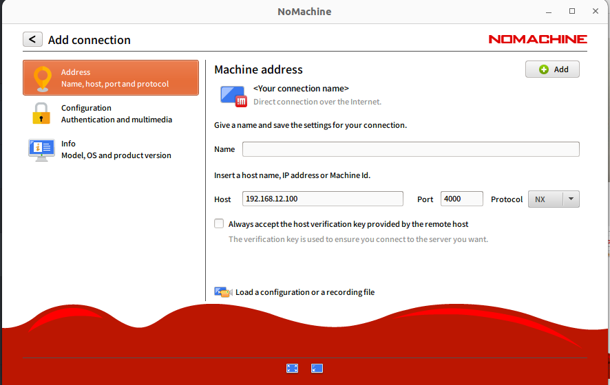

重新回到主界面，此项会新增一个连接对象，双击打开；


弹出新建连接窗口，【Username】中输入账号zl，【Password】中输入密码admin，勾选【Save this passwword in the connection file】，勾选【Always login using this method on this server】，点击【Ok】按钮；


此时NoMachine即可进入到机器人自带的Ubuntu系统；


## 二、关节信息

### 2.1 关节示意图

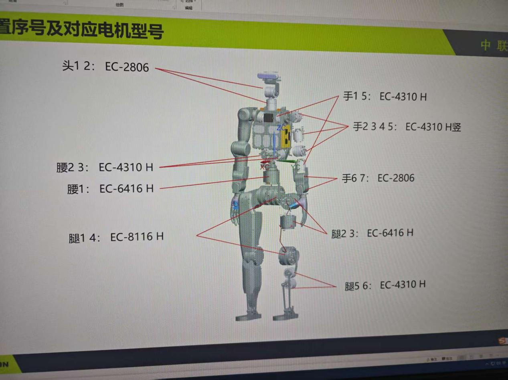

### 2.2 关节信息

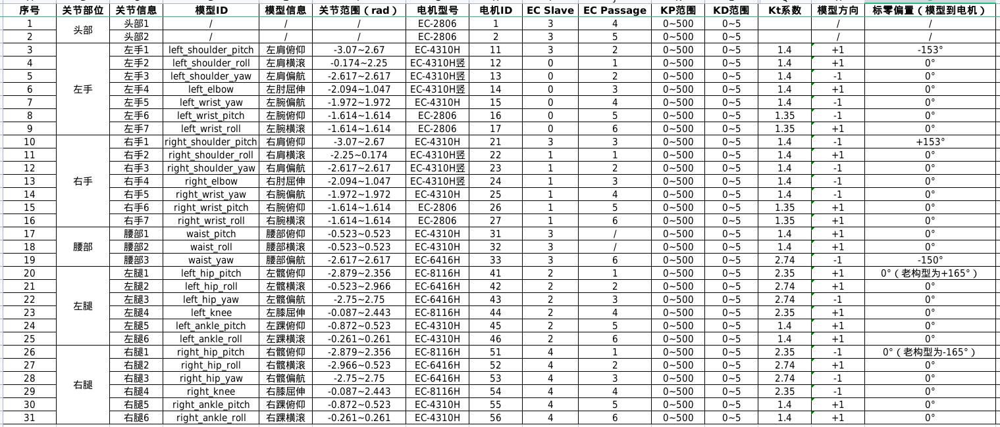

## 三、标零脚本

### 3.1 编译工程

进入工程根目录，打开终端，执行编译脚本：

```bash
~/work/encos_tools/scripts/build.sh
```

编译完成后，再运行电机标定脚本。只有首次运行脚本时需要执行编译。

### 3.2 运行脚本

脚本运行时需要指定模式和网口名称。

#### 3.2.1. 装配前：电机标 ID

机器人装配前，对单个电机进行 ID 读取或设置时，使用 `single` 模式：

```bash
~/work/encos_tools/scripts/run.sh --mode single --net ens33
```

其中，`ens33` 需要替换为实际使用的网口名称。

#### 3.2.2. 装配后：关节位置读取与电机标零

机器人装配完成后，进行关节位置读取和电机标零时，使用 `robot` 模式：

```bash
~/work/encos_tools/scripts/run.sh --mode robot --net ens33
```

如果不指定 `--mode`，脚本默认使用 `robot` 模式。

### 3.3 脚本功能说明

脚本启动后，会进入功能菜单，主要操作包括：

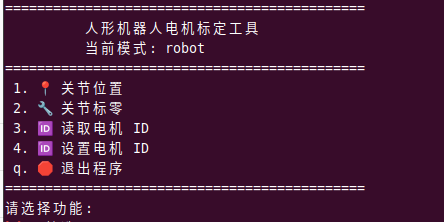

#### 3.3.1. 读取关节位置

选择“关节位置”，根据提示输入关节编号。用于读取指定关节的当前位置，方便确认电机反馈和零位状态。

关节编号范围为 `1-31`，例如：


脚本会根据当前模式下配置的 `slave_id`、`passage` 和 `motor_id` 自动读取对应关节位置。

输入“q”或者“Q”后回车，回到主菜单。

#### 3.3.2. 关节标零

选择“关节标零”，根据提示输入关节编号。脚本会先读取标零前位置，再执行标零操作，最后读取标零后位置。

关节编号范围为 `1-31`，例如：

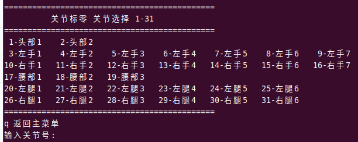

脚本会根据当前模式下配置的 `slave_id`、`passage` 和 `motor_id` 自动进行对应关节标零操作。

输入“q”或者“Q”后回车，回到主菜单。

#### 3.3.3. 读取电机 ID

选择“读取电机 ID”，根据提示输入 `slave_id`；

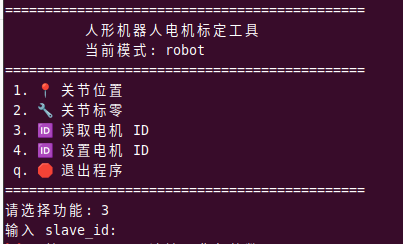

用于查看当前从站下连接的电机 ID；

常用于装配前确认电机当前 ID。

#### 3.3.4. 设置电机 ID

选择“设置电机 ID”，根据提示依次输入：

```text
slave_id
当前/旧 motor_id
目标/新 motor_id
```

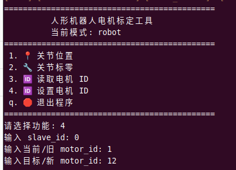

用于将电机从旧 ID 修改为新的目标 ID；

建议标 ID 时一次只连接一个目标电机，避免误操作其他电机。

#### 3.3.5. 退出程序

操作完成后，在主菜单输入：

```text
q
```

脚本会停止服务并退出。

### 3.4 标零注意事项

以下关节标零前需要先摆到指定机械限位：

1. 左手 1 号关节：关节往后摆到限位；
2. 右手 1 号关节：关节往后摆到限位；
3. 左腿 2 号关节：关节往内摆到限位；
4. 右腿 2 号关节：关节往内摆到限位；
5. 腰部 3 号关节：躯干往左摆到限位。

其他关节使用插销或者销块定位零位。到达限位或者定位后，再在脚本中选择对应关节进行标零。

## 四、电机标零

### 4.1 机器人标零工具

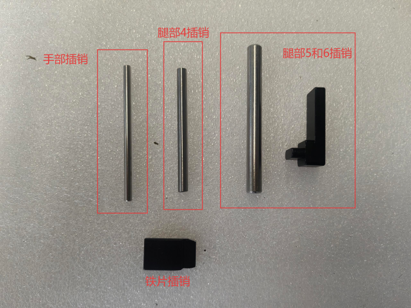

1. 手部插销：用于上肢手臂的对孔处标零使用，将插销插入孔中，使电机无法转动；
2. 腿部4插销：用于下肢腿部4号电机的对孔处标零使用，将插销插入孔中，使电机无法转动；
3. 腿部5和6插销：用于下肢腿部5号和腿部6号电机的标零使用，将粗状插销插入脚掌的孔中，使得脚掌无法左右移动，将黑色插销插入后脚跟的限制位处，使得脚掌无法前后移动（具体实际操作图，下方查看）；
4. 铁片插销：用于两缝隙对齐处标零使用，将两缝隙对齐后，插入铁片插销，使电机无法转动。

### 4.2 手臂1

手臂1（左右同理）通过限位进行标零，将关节往机器人后上方向转动到关节机械限位位置，运行标零脚本，选择对应的数字编号，进行标零操作。

<table>   <tr>     <td align="center">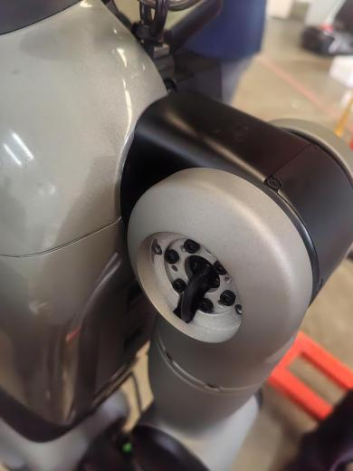</td>     <td align="center">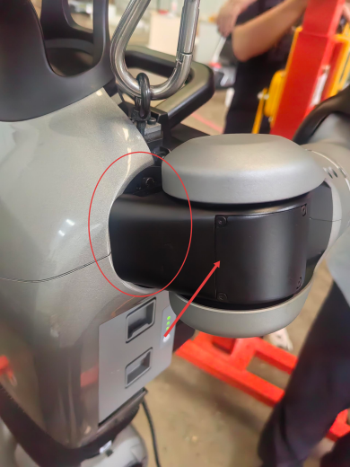</td>     <td align="center">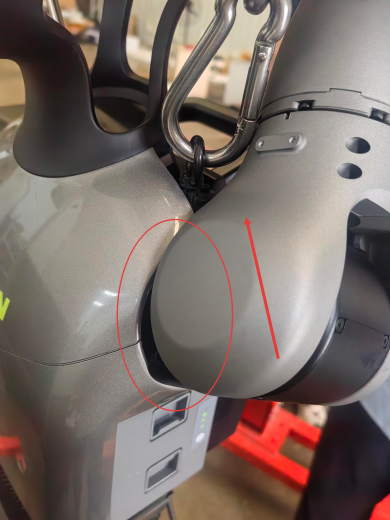</td>   </tr>   <tr>     <td align="center">关节正常位置</td>     <td align="center">关节转动方向</td>     <td align="center">关节限位位置</td>   </tr> </table>

### 4.3 手臂2

手臂2（左右同理）通过插销进行标零，将手部插销插入销孔中，使关节无法转动。运行标零脚本，选择对应的数字编号，进行标零操作。

<table>   <tr>     <td align="center">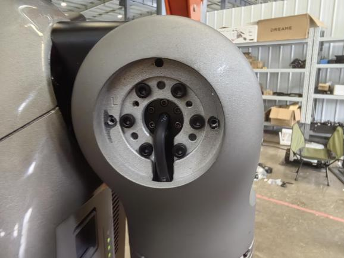</td>     <td align="center">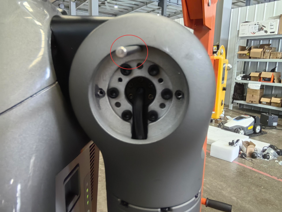</td>    </tr>   <tr>     <td align="center">插销插入前</td>     <td align="center">插销插入后</td>     </tr> </table>

### 4.4 手臂3

手臂3（左右同理）通过插销进行标零，将铁片插销插入销孔中，使关节无法转动。运行标零脚本，选择对应的数字编号，进行标零操作。

<table>   <tr>     <td align="center">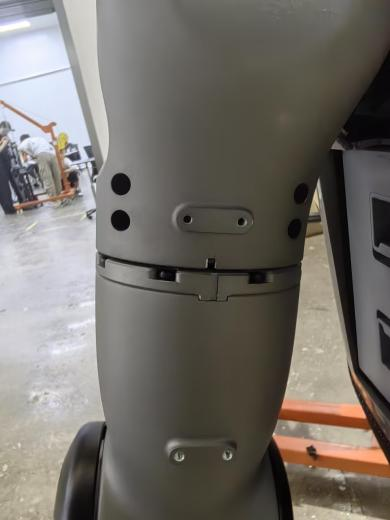</td>     <td align="center">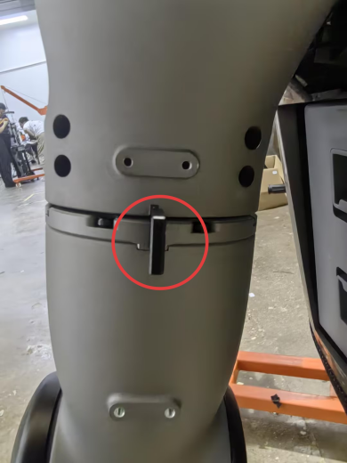</td>    </tr>   <tr>     <td align="center">插销插入前</td>     <td align="center">插销插入后</td>     </tr> </table>

### 4.5 手臂4

手臂4（左右同理）通过插销进行标零，将手部插销插入销孔中，使关节无法转动。运行标零脚本，选择对应的数字编号，进行标零操作。

<table>   <tr>     <td align="center">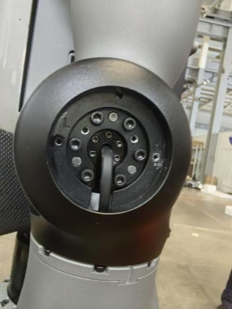</td>     <td align="center">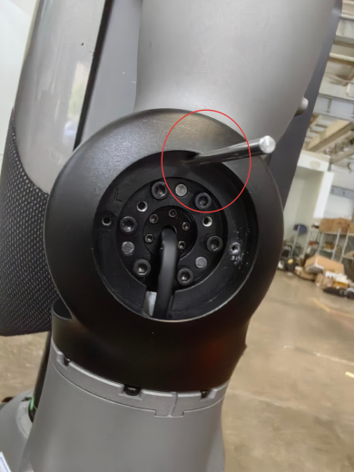</td>    </tr>   <tr>     <td align="center">插销插入前</td>     <td align="center">插销插入后</td>     </tr> </table>

### 4.6 手臂5

手臂5（左右同理）通过插销进行标零，将铁片插销插入销孔中，使关节无法转动。运行标零脚本，选择对应的数字编号，进行标零操作。

<table>   <tr>     <td align="center">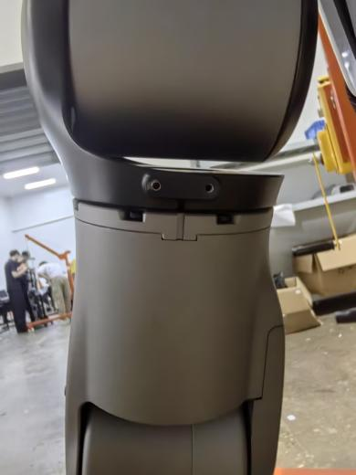</td>     <td align="center">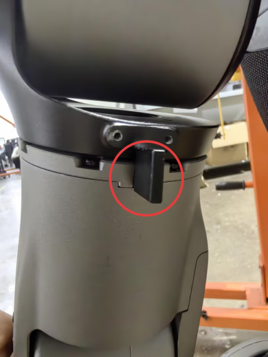</td>    </tr>   <tr>     <td align="center">插销插入前</td>     <td align="center">插销插入后</td>     </tr> </table>

### 4.7 手臂6

手臂6（左右同理）通过插销进行标零，将手部插销插入销孔中，使关节无法转动。运行标零脚本，选择对应的数字编号，进行标零操作。

<table>   <tr>     <td align="center">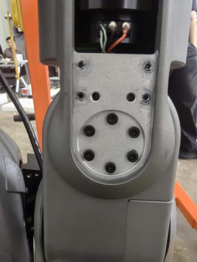</td>     <td align="center">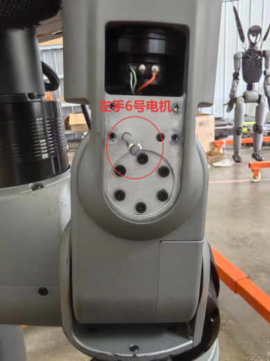</td>    </tr>   <tr>     <td align="center">插销插入前</td>     <td align="center">插销插入后</td>     </tr> </table>

### 4.8 手臂7

手臂7（左右同理）通过插销进行标零，将手部插销插入销孔中，使关节无法转动。运行标零脚本，选择对应的数字编号，进行标零操作。

<table>   <tr>     <td align="center">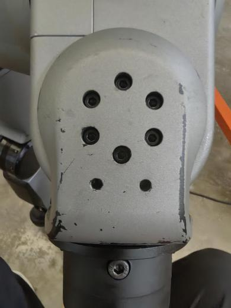</td>     <td align="center">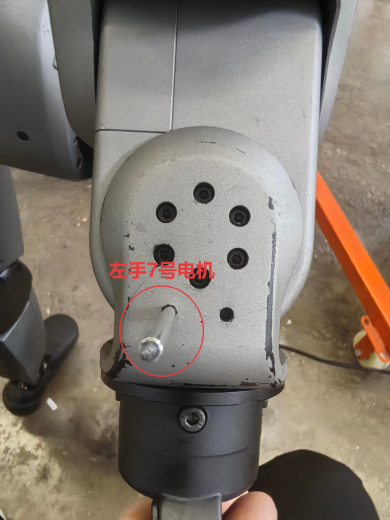</td>    </tr>   <tr>     <td align="center">插销插入前</td>     <td align="center">插销插入后</td>     </tr> </table>

### 4.9 腰部3

腰部3（左右同理）通过限位进行标零，将机器人躯干保持不动，腰部关节顺时针旋转到关节机械限位位置。运行标零脚本，选择对应的数字编号，进行标零操作。

<table>   <tr>     <td align="center">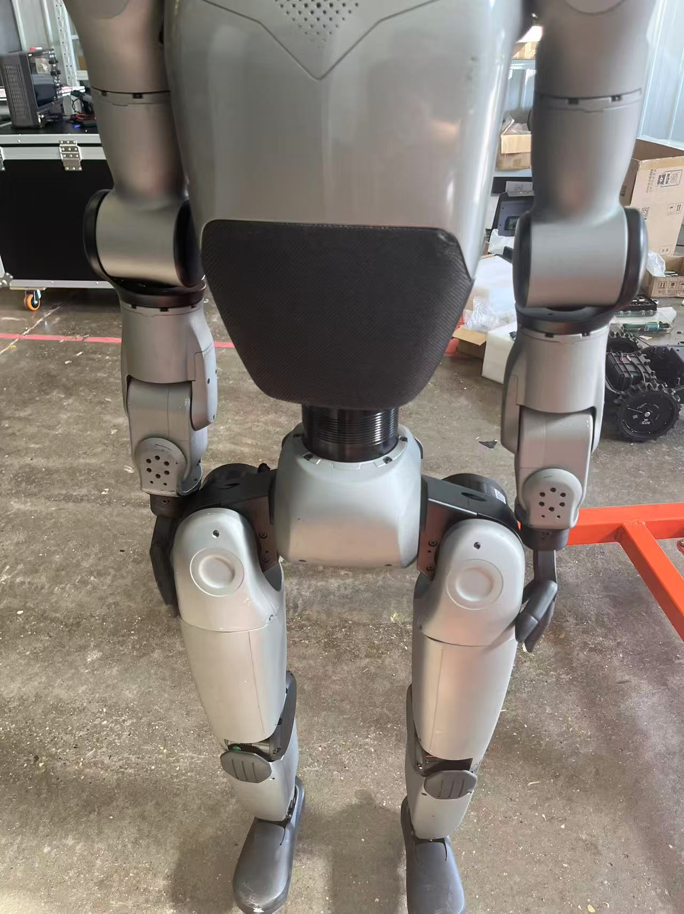</td>     <td align="center">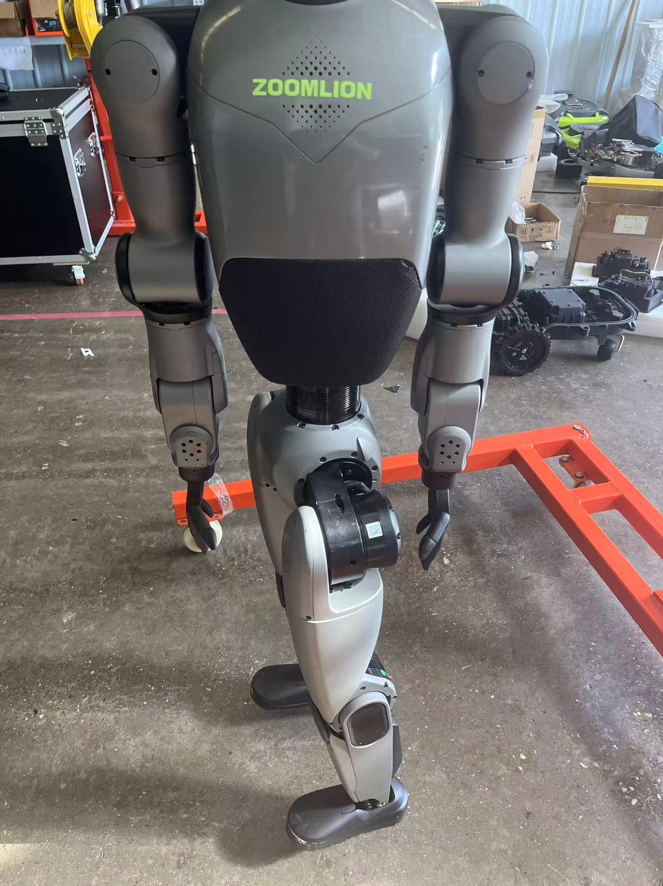</td>     <td align="center">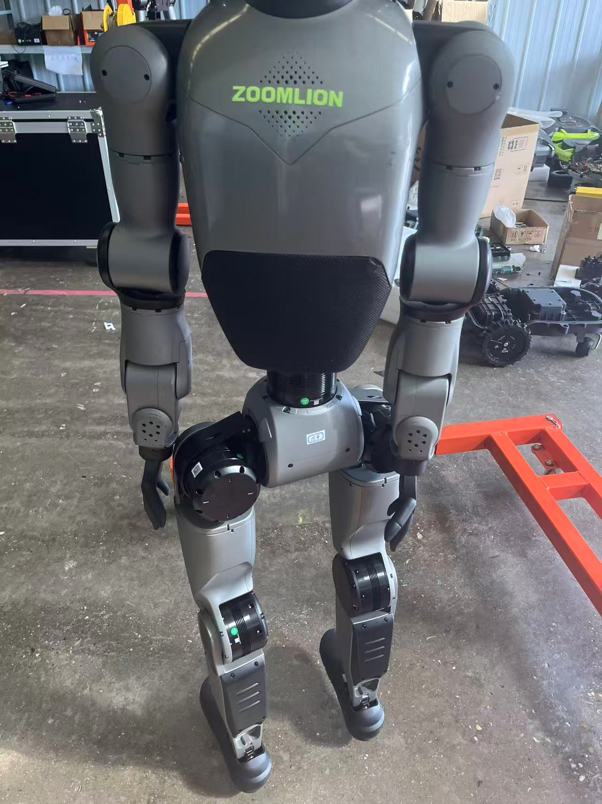</td>   </tr>   <tr>     <td align="center">关节正常位置</td>     <td align="center">关节转动方向</td>     <td align="center">关节限位位置</td>   </tr> </table>

### 4.10 腿部1

腿部1（左右同理）通过插销进行标零，将铁片插销插入销孔中，使关节无法转动。运行标零脚本，选择对应的数字编号，进行标零操作。

<table>   <tr>     <td align="center">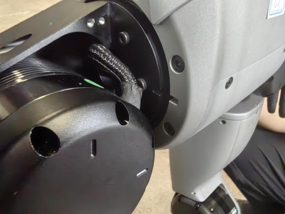</td>     <td align="center">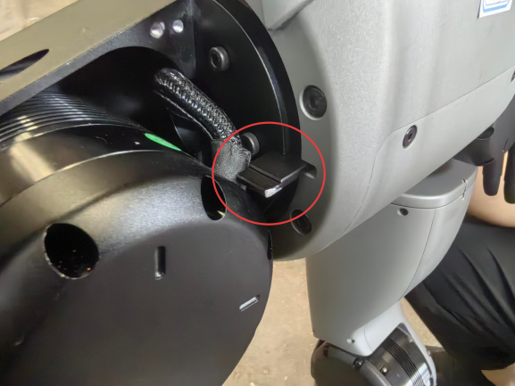</td>    </tr>   <tr>     <td align="center">插销插入前</td>     <td align="center">插销插入后</td>     </tr> </table>

### 4.11 腿部2

腿部2（左右同理）通过限位进行标零，将关节旋转到关节机械限位位置。运行标零脚本，选择对应的数字编号，进行标零操作。

<table>   <tr>     <td align="center">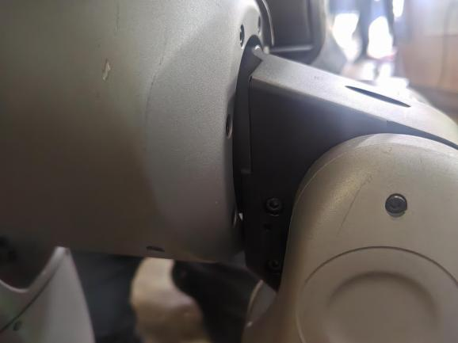</td>     <td align="center">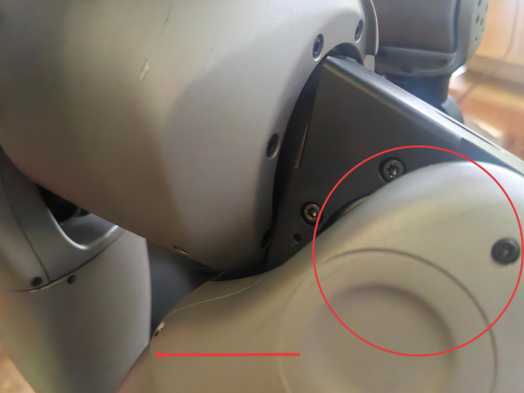</td>    </tr>   <tr>     <td align="center">关节正常位置</td>     <td align="center">关节限位位置</td>     </tr> </table>

### 4.12 腿部3

腿部3（左右同理）通过插销进行标零，将铁片插销插入销孔中，使关节无法转动。运行标零脚本，选择对应的数字编号，进行标零操作。

<table>   <tr>     <td align="center">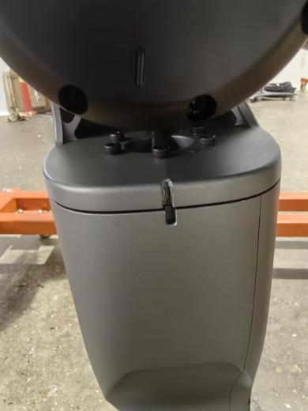</td>     <td align="center">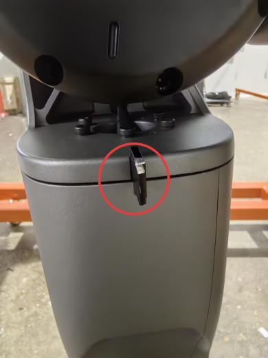</td>    </tr>   <tr>     <td align="center">插销插入前</td>     <td align="center">插销插入后</td>     </tr> </table>

### 4.13 腿部4

腿部4（左右同理）通过插销进行标零，将腿部4插销插入销孔中，使关节无法转动。运行标零脚本，选择对应的数字编号，进行标零操作。

<table>   <tr>     <td align="center">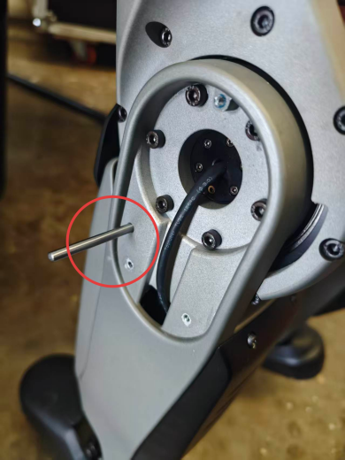</td>       </tr>   <tr>      <td align="center">插销插入后</td>     </tr> </table>

### 4.14 腿部5和6

腿部5和6（左右同理）通过插销进行标零，将腿部5和6插销中的圆柱插销插入脚掌的孔中，脚掌部位无法左右扭动；将腿部5和6插销中的压片插销安装在脚后跟上，微微调整脚掌部位前后扭动，使压片插销与脚跟结构件的缝隙能透光并且是平行。运行标零脚本，选择对应的数字编号，进行标零操作。

<table>   <tr>     <td align="center">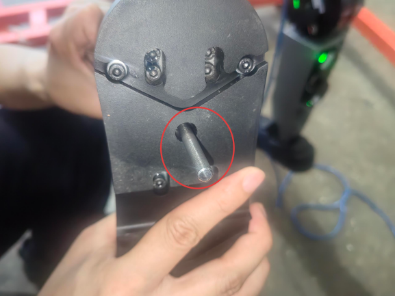</td>     <td align="center">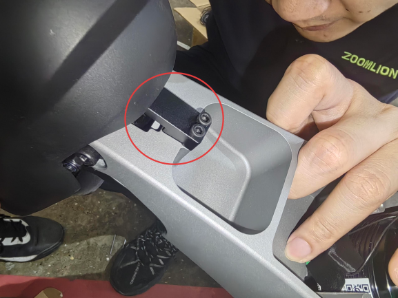</td>     <td align="center">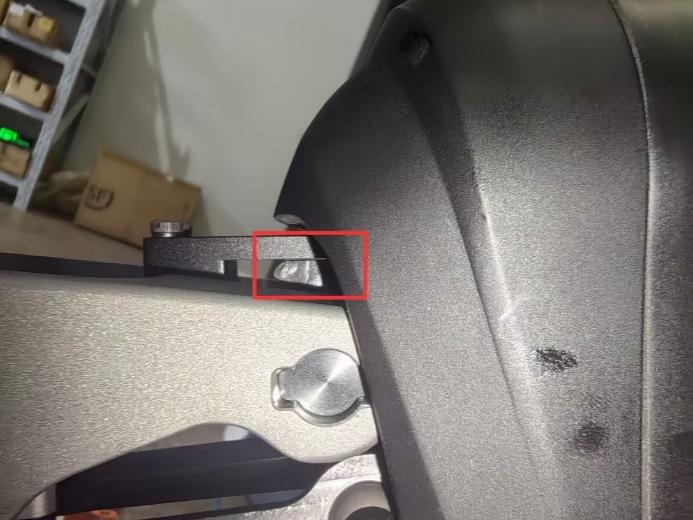</td>   </tr>   <tr>     <td align="center">脚掌圆柱插销</td>     <td align="center">脚跟压片插销</td>     <td align="center">压片插销缝隙平行</td>   </tr> </table>

